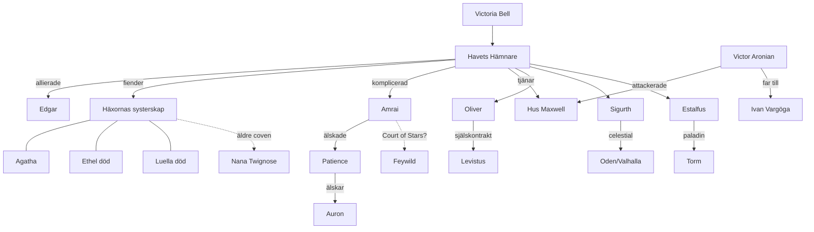

# Eshen — Kampanjwiki

> [!abstract] Kampanjen i en mening
> Fyra skeppsbrutna utan minnen vaknar på ett vrak vid en kust som inte borde finnas, i ett år som inte är deras eget — och nystar sakta upp varför gudarna inte kan se dem, medan [[Eshen]] skälver under revor i den magiska väven, häxor, jättar och en flygande borg som just stulit [[Mythaler|Mirfields hjärta]].

**Partyt:** [[Havets Hämnare]] — [[Estalfus Envalor]] · [[Idun Svavelfäll]] · [[Oliver Underberg]] · [[Sigurth Andersson]] · [[Renache]] · [[Brandon Taylor]]

**Just nu (Krönikan pågår):** Partyt har flugit upp till [[Den flygande borgen]] efter att [[Victor Aronian]] paraliserat [[Maxwellbalen]] och en gigantisk klo slitit loss [[Mythaler|Mythalern]] ur Mirfields grund. Ombord: snö, ogres, en drake i en skattkammare — och [[Vampyrkvinnan]] som fortfarande håller Sigurth charmad. Se [[Arc 15 - Hemkomsten och Maxwellbalen]].

> [!warning] Stående OBS
> **Återuppliva EJ Sigurth. Han löser det själv(?)** — se [[Sigurth Andersson]] och [[Sigurths sanna natur]].

---

## Krönikan (story arcs)

| # | Arc | Period (session) |
|---|-----|------------------|
| 1 | [[Arc 01 - Skeppsbrottet och Strawford]] | 2018-05 → 2018-06 |
| 2 | [[Arc 02 - Vägen till Mirfield]] | 2018-06 → 2018-07 |
| 3 | [[Arc 03 - Mirfield och Ändsommarskörden]] | 2018-07 → 2018-09 |
| 4 | [[Arc 04 - Revan och tornet vid Highfort]] | 2018-10 → 2018-11 |
| 5 | [[Arc 05 - Starcrest Keep och labyrinten]] | 2018-11 → 2019-01 |
| 6 | [[Arc 06 - Agathas hämnd och Ethel]] | 2019-01 → 2019-04 |
| 7 | [[Arc 07 - Intriger i Mirfield]] | 2019-05 → 2019-06 |
| 8 | [[Arc 08 - Stygia och Hades]] | 2019-06 → 2019-10 |
| 9 | [[Arc 09 - Turneringen och sirenernas rop]] | 2019-10 → 2020-03 |
| 10 | [[Arc 10 - Farwater]] | 2020-03 → 2020-12 |
| 11 | [[Arc 11 - Snöfall och jättarnas Ordning]] | 2020-12 → 2021-05 |
| 12 | [[Arc 12 - Det Yttre Torget]] | 2021-06 → 2021-09 |
| 13 | [[Arc 13 - Myth Inventos och Phaerimm-kriget]] | 2021-09 → 2023-03 |
| 14 | [[Arc 14 - Shadowfell och Korpdrottningen]] | 2023-04 → 2024-07 |
| 15 | [[Arc 15 - Hemkomsten och Maxwellbalen]] | 2024-08 → pågår |

Fullständig kronologi: [[Tidslinje]]

---

## Ingångar

### Personer
- Partyt: [[Havets Hämnare]] (med tidigare följeslagare [[Vorga]] och [[Storm]])
- Mirfield: [[Victoria Bell]] · [[Edgar]] · [[Dhrovag Drombus]] · [[Illiyana]] · [[Isondra]] · [[Slim]] · [[Bulbas]] · [[Seebo Timbers]] · [[Tibbs Tobberhook]] · [[Felicia Bennet]]
- Kungahuset: [[Jonathan Maxwell]] · [[Prinsessorna Lucy och Isabelle]] · [[Drottning Rosaline]] · [[Leroy Maxwell]]
- Adel: [[Sir Wilfred]] · [[Miles Gifford]] · [[Viktor Panzar]] · [[Melony Yates]] · [[Seraphine Lindyr]] · [[Lord Whitecrow]] · [[Winston och Elinor Philips]]
- Häxorna: [[Agatha Toestealer]] · [[Ethel]] · [[Luella]] · [[Mathilda]] · [[Nana Twignose]] · [[Tant Wilma]] · [[Grandmother]]
- Starcrest-kretsen: [[Amrai]] · [[Patience]] · [[Auron]] · [[Shiva]] · [[Eslan]] · [[Estalfus mor]]
- Antagonister: [[Victor Aronian]] · [[Vampyrkvinnan]] · [[Visage]] · [[Delmar]] · [[Vargas Fellwrouth]] · [[Brysis of Khaem]] · [[Rive]] · [[Levistus]]
- Gudar: [[Torm]] · [[Korpdrottningen]] · se [[Gudar och religion]]

### Platser
- Världen: [[Eshen]] · [[Yudon]] · [[Vadaria]] · [[Vespia]] · [[Akrylia]]
- Städer: [[Mirfield]] · [[Highfort]] · [[Lion's Hold]] · [[Newgale]] · [[Farwater]] · [[Kirkwall]] · [[Highmont]] · [[Arkny]] · [[Hogsfeet]] · [[Strawford]]
- Platser: [[Starcrest Keep]] · [[Revan]] · [[Myth Inventos]] · [[Bronze Woods]] · [[Summer Woods]] · [[Siren's Call]] · [[Dansande Katten]]
- Andra plan: [[Stygia]] · [[Hades]] · [[Shadowfell]] · [[Gloomwrought]] · [[Fortress of Memories]] · [[Trueheart]] · [[Valhalla]]

### Fraktioner
[[Magiska institutet]] · [[Ordningen]] · [[Häxornas systerskap]] · [[Yttre Torgets syndikat]] · [[Hus Maxwell]] · [[Hus Gifford]] · [[Hus Panzar]] · [[Hus Lindyr]] · [[Hus Yates]] · [[Hus Gurin]] · [[Hus Aronian]] · [[Silvermoons]] · [[Pegasus Express]] · [[Asathal]] · [[Netheril]] · [[Phaerimm]] (varelse/fiende) · [[Gloomwroughts adelshus]] · [[Ravenguard]]

### Föremål
[[Dawnbringer]] · [[Sjörövaren]] · [[Mythaler]] · [[Bärnstenspilen]] · [[Soul Stones]] · [[Hagornas öga]] · [[Modersringen]] · [[Månbrunnens ringar]] — fler i [[Föremålsregister]]

### Varelser
[[Phaerimm]] · [[Boneclaw]] · [[Häxor]] · [[Uvarjotunen]] · [[Sirener]] · [[Sahuagin]] · [[Cockatrice]] · [[Shadar-kai]] · [[Barixis]]

### Händelser
[[Ankomsten]] · [[Ändsommarskörden 1540]] · [[Arcanalicens-ceremonin]] · [[Snöfall 1540]] · [[Magikrisen i Mirfield]] · [[Slaget om Yttre Torget]] · [[Phaerimm-drottningens fall]] · [[Amrais val]] · [[Maxwellbalen]] · [[Mythalerns rov]] — historiska: [[Netherils fall]] · [[Brimstones död]] · [[Easthalls fall]] · [[Mörkrets ankomst i Akrylia]]

### Mysterier
[[Öppna frågor]] · [[Tidsresan och de förlorade minnena]] · [[Harpan och Lutan]] · [[Den femte huvudmagikern]] · [[Lord Whitecrow och kråkorna]] · [[Akrylias tystnad]] · [[Sigurths sanna natur]] · [[Vampyrkvinnan]] · [[Thrains varning]] · [[Patience och Court of Stars]]

### Referens
[[Gudar och religion]] · [[Kalender och högtider]] · [[Skeppsregister]] · [[Arcanalicens]] · [[Föremålsregister]]

---

## Relationskarta (förenklad)

> [!tip] Vault-konventioner
> - **In-world röst** på entitetssidor; tärningar, XP och bordsskämt bor i Krönikans loggar.
> - Teorier och spekulation står alltid i `[!question]`-callouts märkta **Teori** — aldrig i brödtexten som fakta.
> - Motstridiga uppgifter i källmaterialet markeras med `[!warning]`-callouts.
> - Datum: in-game-året är **1540** (partyt trodde först 1535 — se [[Tidsresan och de förlorade minnena]]).
